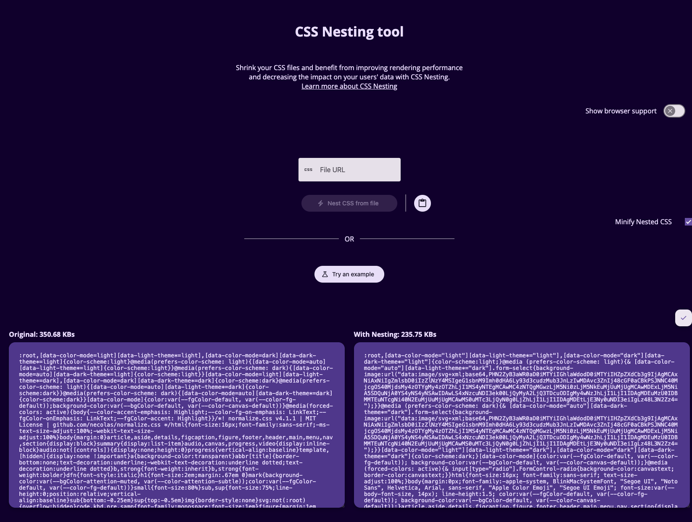

# [CSS Nesting tool](https://charistheo.github.io/css-nesting-tool/)

> Publicly hosted here: https://charistheo.github.io/css-nesting-tool/

Shrink your CSS files and benefit from better rendering performance and save your users' data with CSS Nesting.

🎉 [CSS Nesting is part of Interop 2024](https://github.com/web-platform-tests/interop/issues/420)
📖 [Learn more about CSS Nesting](https://developer.chrome.com/articles/css-nesting/)



## Development

### Run locally

1. Clone repo

```sh
git clone https://github.com/charisTheo/css-nesting-tool.git && cd css-nesting-tool
```

2. Install dependencies

```sh
npm i
```

3. Run dev server

```sh
npm start
```

### Build and run production

[All steps above](#run-locally) and:

```sh
npm run build && npm run serve
```

### CSS Optimisations

- [x] Merge multiple selectors with the same properties

    ```css
    .selector-1 {
      padding: 20px;
      margin: 20px;
    }
    .selector-2 {
      padding: 20px;
      margin: 20px;
    }
    .selector-3, .selector-4 {
      padding: 20px;
      margin: 20px;
    }

    /* Merge into */
    .selector-1, .selector-2, .selector-3, .selector-4 {
      padding: 20px;
      margin: 20px;
    }
    ```

- [x] Merge selectors with same parent

    ```css
    .selector {
      padding: 10px;
    }
    .selector.additional {
      padding: 20px;
    }
    .selector.additional .child {
      margin: 20px;
    }

    /* Merge into */
    .selector {
      padding: 10px;

      &.additional {
        padding: 20px;

        & .child {
          margin: 20px;
        }
      }
    }
    ```
